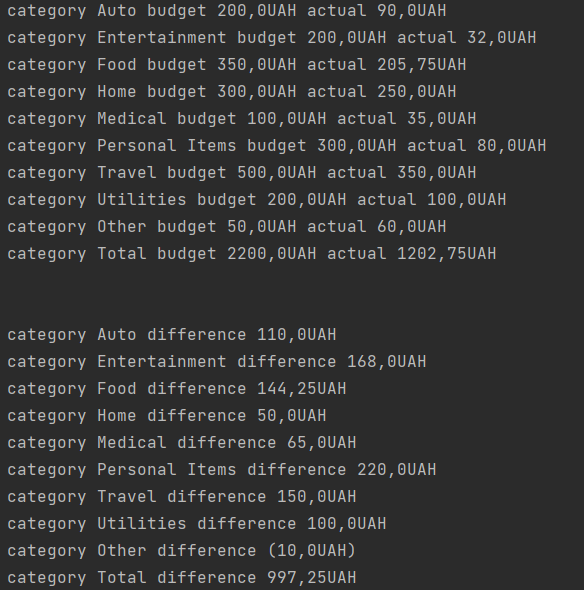

# pdf-parser

    Use command git clone ###(https://github.com/sashababakop1489/PDFParser)
    * `Add your pdf file to resource package`
    * `First of all you must know all name fields in table in your pdf file`
    * `Open package model then class Model and change name fields`
    * `Go to the Main class and change the file name ("sample.pdf") to your own`
    * `After the above actions, you will get this result (field value)`

